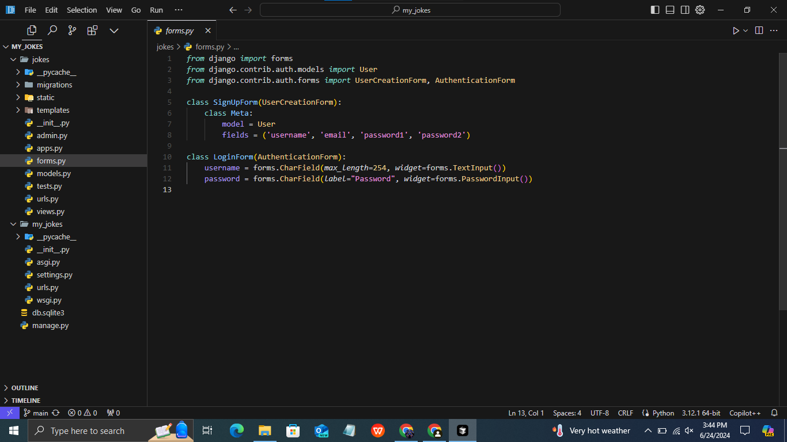
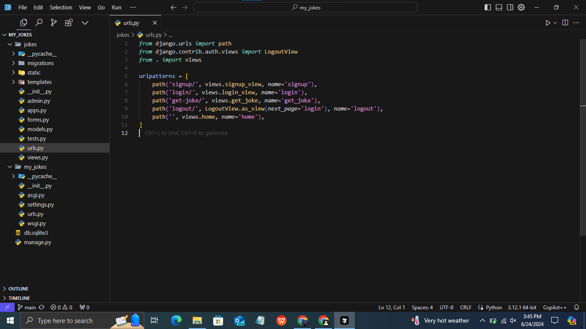
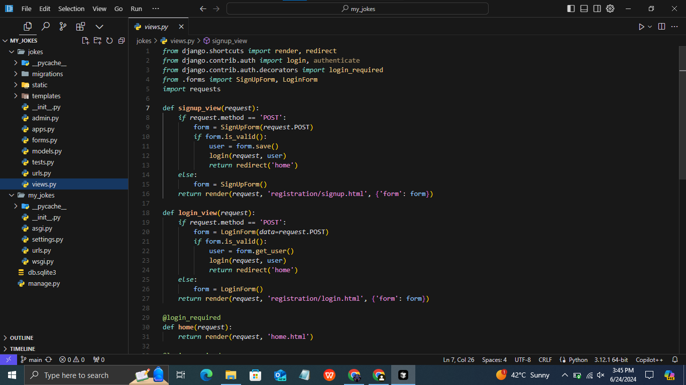
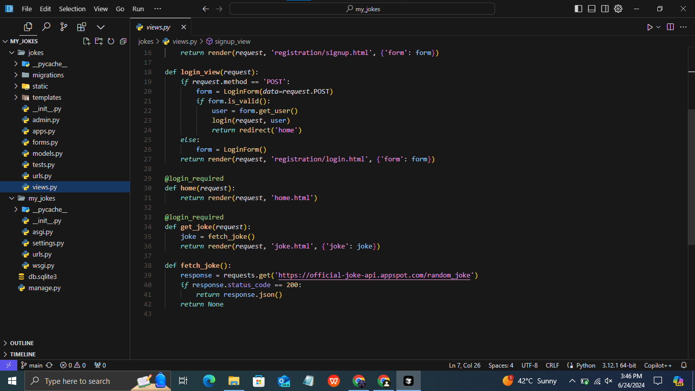
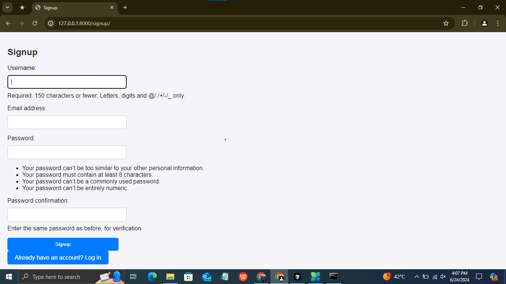
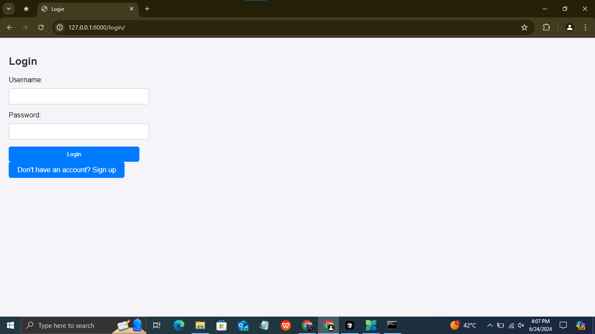
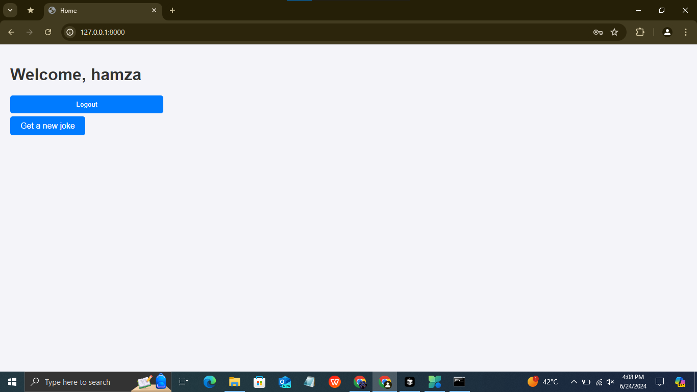
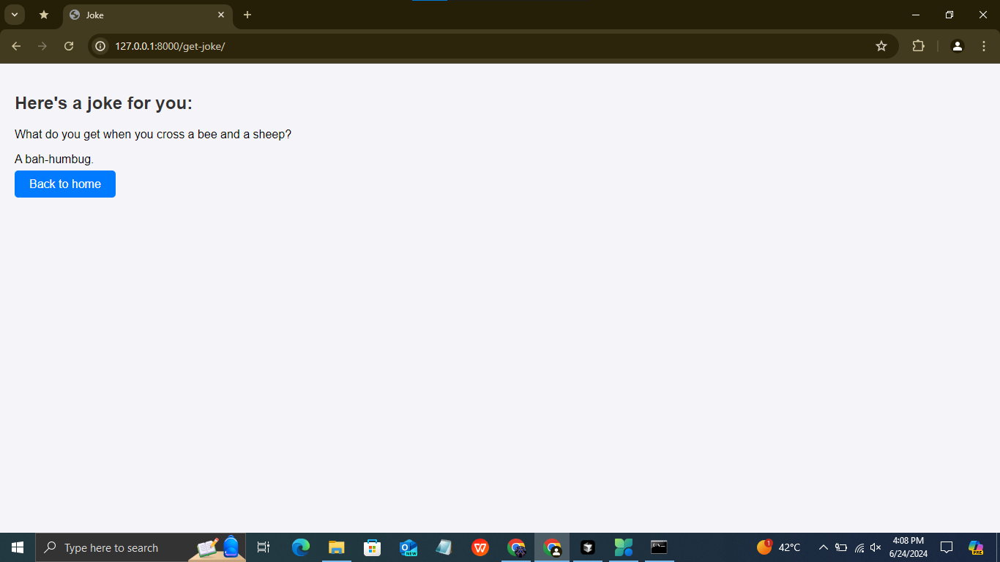

# My Jokes App

My Jokes is a web application built with Django that allows users to register, log in, and view random jokes fetched from an external API.

## Table of Contents

- [Features](#features)
- [Installation](#installation)
- [Usage](#usage)
- [Technologies Used](#technologies-used)
- [Screenshot](#screenshot)

## Features

- **User Authentication**: Includes signup, login, and logout functionalities using Django's built-in authentication system.
- **Random Jokes**: Fetches random jokes from the [Official Joke API](https://official-joke-api.appspot.com/random_joke).
- **User Interface**: Provides a simple and intuitive UI for user interaction.
- **Responsive Design**: Ensures usability across various devices and screen sizes.

## Installation

1. **Clone the repository:**

   ```bash
   git clone <repository-url>
   cd my_jokes
   
2. **Create a virtual environment and activate it:**

   ```bash
   python -m venv venv
   source venv/bin/activate  # On Windows use `venv\Scripts\activate`

3. **Install dependencies:**

   ```bash
   pip install Django
   pip  install Requests

4. **Apply database migrations:**

   ```bash
   python manage.py migrate

5. **Run the development server:**

   ```bash
   python manage.py runserver

6. **Run the development server:**
   Open a web browser and go to `http://localhost:8000`

## Usage
 - **Signup:** Create a new user account by filling out the signup form.
 - **Login:** Existing users can log in with their credentials.
 - **Home:** Upon login, users are redirected to the home page where they can click on "Get Joke" to view a random joke.
 - **Get Joke:** Fetches a random joke from the API and displays it on the page.

## Technologies Used
 - **Python:** Programming language used for backend development.
 - **Django:** Python web framework used for building the application.
 - **HTML/CSS:** Frontend markup and styling.
 - **Requests:** Python library used for making HTTP requests to fetch jokes from the API.

## Screenshots
 - **forms:**
      
 - **urls:**
      
 - **views:**
      
      
 - **Signup:**
      
 - **Login:**
      
 - **Home:**
      
 - **Joke Display:**
      
